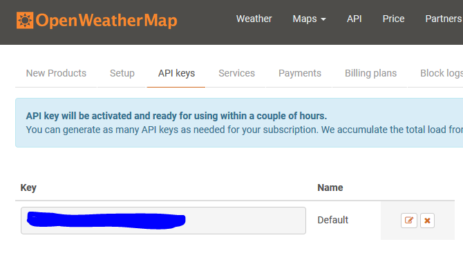
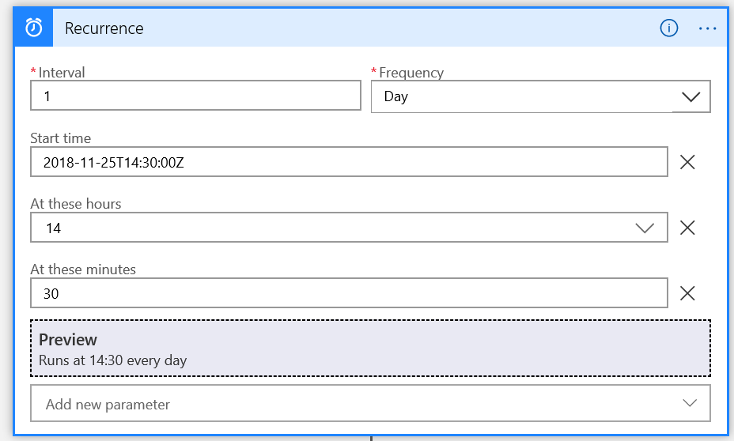
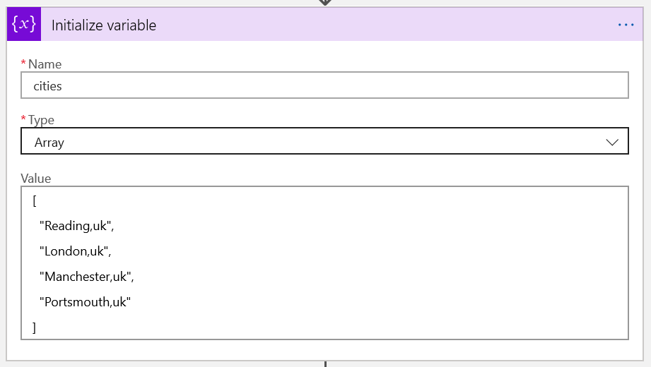
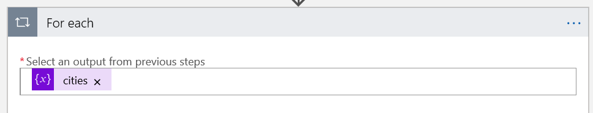
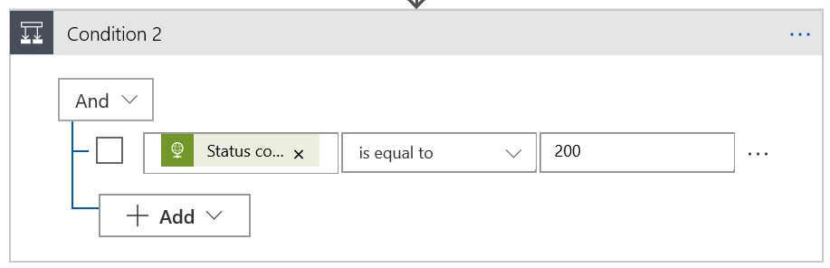
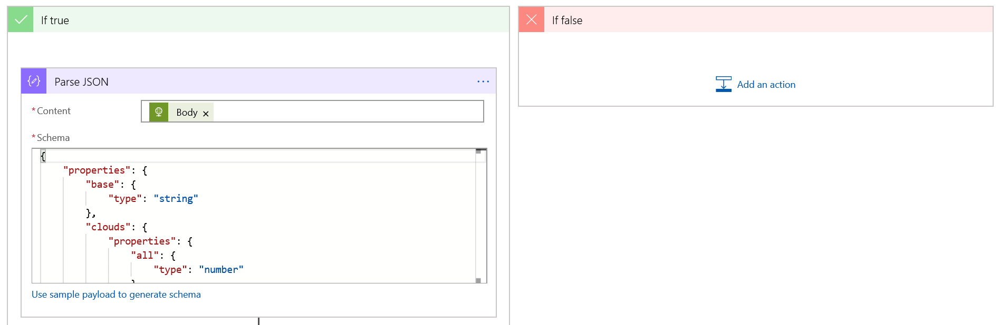
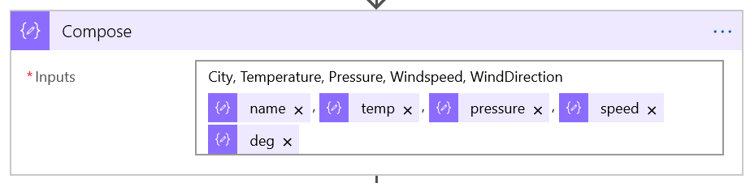
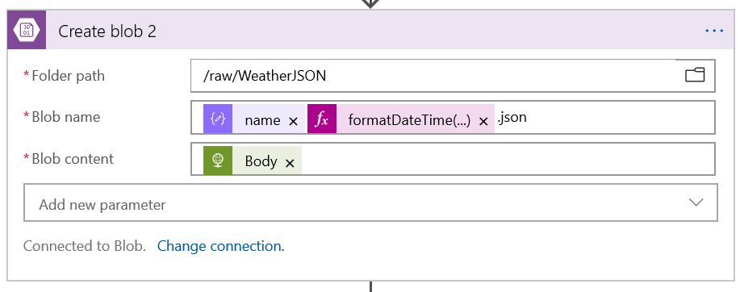
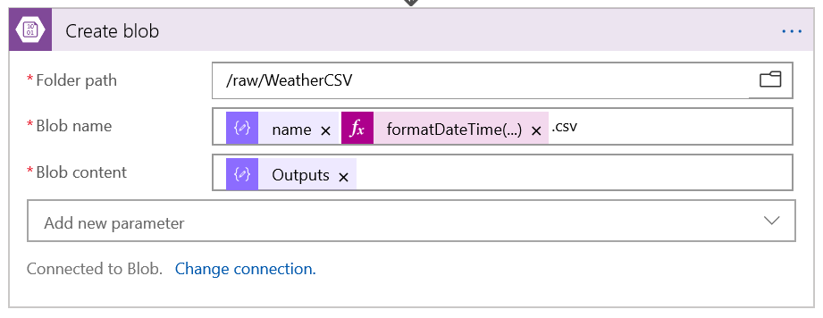
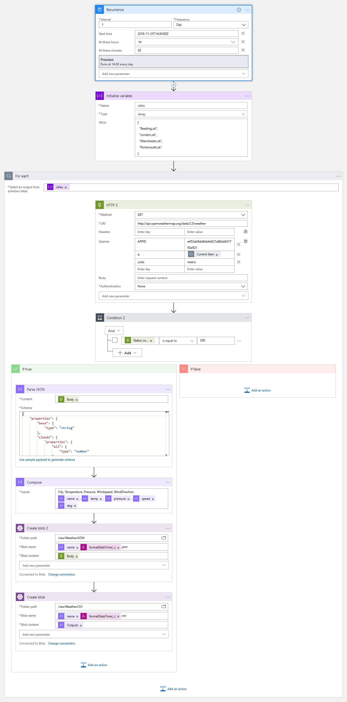

# Lab 2 - Getting external data using Logic App

## Introduction

During this lab we will create a Logic App to download weather data from an Internet API. This data will later be used to enrich the sales data we imported with Data Factory in the first lab.
In the logic app, we’ll be making the following structure. A timer will kick off the run once per day, then call the API for each city in the list then write the response to our data lake if it succeeds. If not you can send a mail or tweet to yourself.

The solution is shown here:


For a look at the completed Logic App flow, scroll to the bottom of these instructions.

# Setup

## Weather Data Account

Head to [openweathermap](https://openweathermap.org) and sign up for API access. This will give you an API key to use when requesting data. The service is free up to certain traffic limits which we won’t hit if using it for daily updates on a small number of cities.



You’ll need the key from this box later.

## Logic App

To begin, open the Logic App in your resource group. Click on to the Logic App Designer to begin creating the app. Add a recurrence trigger to the app first. This will fire once a day to collect weather data.
	


Set the interval to one day and the start time to the current time. Set the hours and minutes to something suitable, in this example we used 14:30 to trigger every day at 2:30pm. Next, add an initialize variable action below your timer. This will be used to add a list of cities for which to collect data. We'll then call the API once for each of these.



Name the variable "cities" and choose an array type. Add the below JSON to the value box. This will create an array with the four cities. You may want to try adding another city of your own. Note the JSON format has a comma on every line except the last when creating arrays.
```json
[
  "Reading,uk",
  "London,uk",
  "Manchester,uk",
  "Portsmouth,uk"
]
```
Now, create a for each loop action after your variable action. This will iterate through the array we just created, one city at a time.



Using the dynamic content pane that pops up, add the "cities" variable as the output from a previous step. This shows the loop what to iterate through. You'll now have a new area to add actions within the for each loop. It's important to add actions here rather than after the loop to ensure they are carried out for each city. If you add actions after the loop, they will happen when the loop completes.

Add an HTTP request to this list of actions. This will call the API and receive the weather data back.


Set the method to GET and add the URI http://api.openweathermap.org/data/2.5/weather as documented on the API website. Note that there are many other APIs on this site and millions on other sites which you can use to get various other information for your data lake. Add the queries APPID, q, and units, adding in your own API key under APPID. Set the q query to current item using dynamic content, and then metric for the units. By default the API uses SI units so your temperature would come back in Kelvin without this. Next, add a condition after your HTTP request. We'll use this to determine whether the call to the API was successful.



Add the status code from the HTTP request as the condition using dynamic content. set it to "is equal to" and 200 to check for an HTTP success code. You can check for any HTTP code here to do thorough error handling, but generally we only care about success or failure for this action.



You'll now have two branches, one for true (success) and one false (failure). You can add in an email action to the failure side, or some other useful action to log or correct an error. We won't fill that in here as this is a demo.

Next, call the API manually in a new browser tab to get a sample of the payload. We'll need to use this in the Parse JSON task to generate a schema as it's easier than writing the schema manually. You could also find the schema in the documentation of the API. The schema detection is not perfect, so you may need to change some Integer types to Number if you have errors when running the app. To call the API manually use the following but remember to replace <YOURAPIKEY> with your actual API key:

``` http://api.openweathermap.org/data/2.5/weather?APPID=<YOURAPIKEY>&q=reading,uk&units=metric ```

This will return some JSON which you need to copy.

Now add a parse JSON action to the "if true" branch. Add Body from the HTTP request to the content box using dynamic content. Next, click "use sample payload to generate schema" and paste in the JSON from the other browser tab. This action will split the JSON into variables so we can use them later. Now add a Compose action after your Parse JSON job. We'll use this to create a CSV format version of some of the data.



In the Inputs, add the first line `City, Temperature, Pressure, Windspeed, WindDirection` and then add in the matching variables from the parse JSON action on the next line. These are `Name, temp, pressure, speed, deg` which are the labels from the JSON returned from the API. This will result in a CSV formatted file which we'll use later. 
Now add in two Create Blob jobs. Follow the connection wizard by adding a name and choosing the Raw container in your storage account, which is where we will store the data.



The first create blob will store the raw JSON data as returned from the API. We may decide later on to store more of the information returned from the API so Blob or Data Lake will provide the most cost effective storage option to do so. Set the folder path to `/raw/WeatherJSON` (you may need to copy-paste this) then use dynamic content to get the `name` variable and also to create an expression for `formatDateTime(utcnow(), 'yyyy-MM-dd')` which will return the current date in year, month, day format which is useful for filenames. Add .json to the end as the file extension. Set the Blob Content to the body of the HTTP request.



For the second create blob do exactly the same thing, but with the folder as `/raw/WeatherCSV` and the content as the output from the compose task.

Now save and run your logic app. This should complete successfully and create four files in each of the specified folders.

This diagram shows the completed Logic App

 

# Next

Now you can go on to [Lab 3a](../Lab3a/Lab3a.md) or [Lab 3b](../Lab3b/Lab3b.md)
