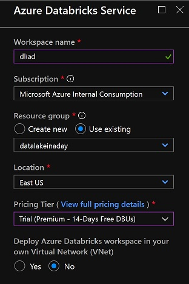
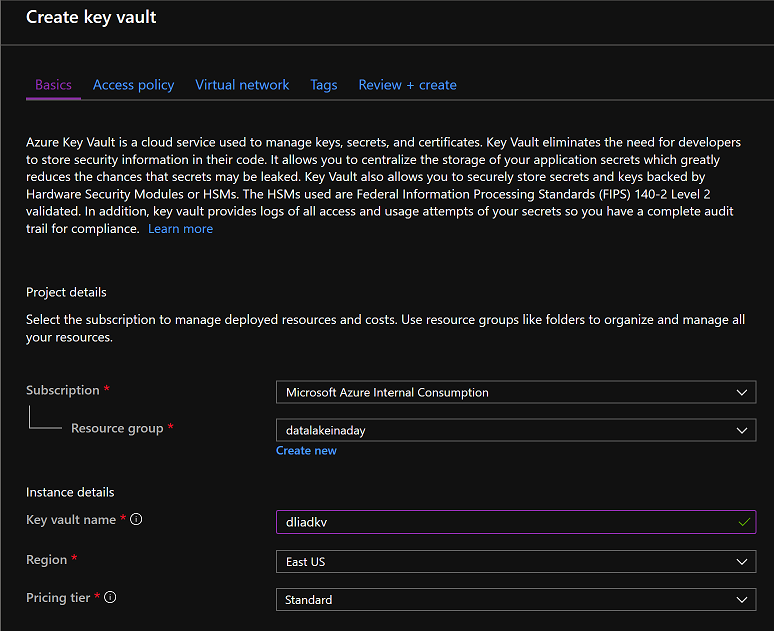
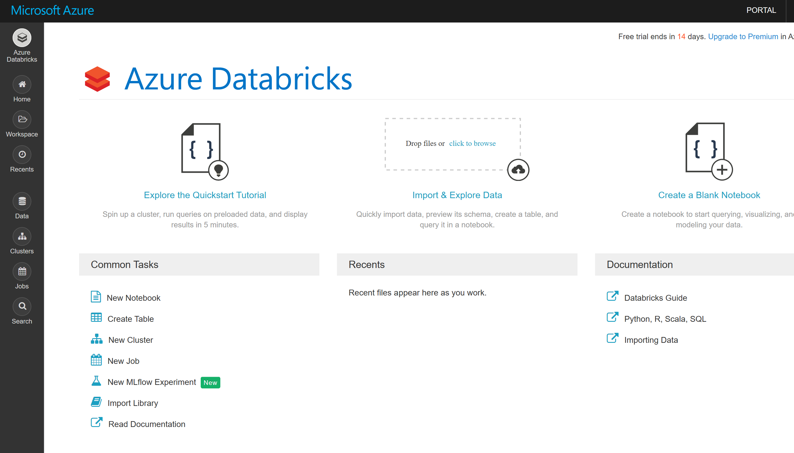
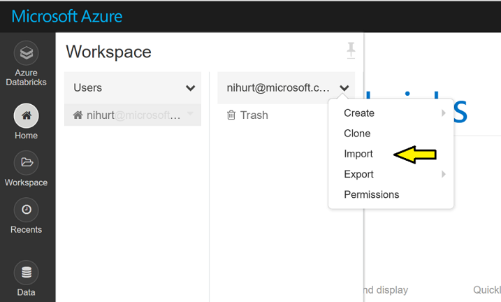
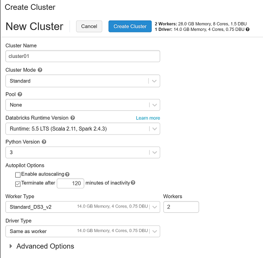
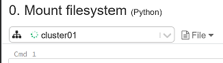
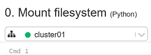

# Lab 3 - Process data using Databricks

## Introduction

In this lab we will transform some of our data using Databricks. This will be achieved running Spark SQL commands in an interactive notebook environment. 

## Provision the Databricks Workspace

<table>
<tr>
<td width="60%">To get started, first create a Databricks workspace in the East US region. Make use of the trial pricing tier. </td>
<td width="40%"></td>
</tr>
</table>

Note you are only billed for the time your cluster is running, and you can use the pricing calculator to get an idea of costs. Essentially though you’re paying for the underyling VMs (which are provisioned in an automatically created resource group) and DBUs which are processing units per hour. If you take the free trial, you will only pay for the VMs.

## Provision Key Vault

<table>
<tr>
<td width="60%">You will also need an Azure Key Vault to store secrets. Create a key vault as shown in the diagram below.</td>
<td width="40%"></td>
</tr>
</table>

## Accessing ADLS or Blob from Databricks

If you have access to your AAD to create an application & service principle then use ADLS otherwise use the storage account created by the initial deployment script. If using [Azure Data Lake Storage with Databricks](https://docs.databricks.com/spark/latest/data-sources/azure/azure-datalake-gen2.html#azure-data-lake-storage-gen2) you will require a service principal with delegated permissions. Start by creating a [Gen2 storage account](https://docs.microsoft.com/en-us/azure/storage/blobs/data-lake-storage-quickstart-create-account) with [hierarchical namespace](https://docs.microsoft.com/en-us/azure/storage/blobs/data-lake-storage-namespace) enabled. Once created, go the resource and scroll down the Data Lake Storage section and create a new container/filesystem called "datalake".

Follow the steps in the [documentation](https://docs.databricks.com/data/data-sources/azure/azure-datalake-gen2.html#create-and-grant-permissions-to-service-principal) to create a service principal by registering an application and then assigning the “Storage Blob Data Contributor” role to the service principal (the registered application) at the level of the resource i.e. in the access control of the data lake storage account. Also follow the steps to create a [new application secret](https://docs.microsoft.com/en-us/azure/active-directory/develop/howto-create-service-principal-portal#create-a-new-application-secret) which will be stored later in Key Vault. If you're using Blob storage, you will use the access keys for the storage account.

## Import the Databricks notebooks

<table>
<tr>
<td width="60%">By now your Databricks workspace should be ready, find the resource and click Launch Workspace. A new tab will open and the Databricks workspace landing page will be displayed. You may be prompted for your Azure credentials again.</td>
<td width="40%"></td>
</tr>
<tr>
<td width="60%">Next import the notebooks required for this lab. Click on the Home icon, and click on the drop menu next to your username to reveal the import option as shown below. </td>
<td width="40%"></td>
</tr>
<tr>
<td width="60%"></td>
<td width="40%"></td>
</tr>
<tr>
<td width="60%"></td>
<td width="40%"></td>
</tr>
</table>

Import from this [archive](DataLakeInADay.dbc)

If successful you will notice a new folder entitled DataLakeInADay appear, which contains a set of notebooks and some sub-folders.

## Store your secrets in Key Vault
Before proceeding any further, let's add your secret to the Key Vault provisioned earlier. Navigate to this resource, open the Secrets blade and click Generate/Import. Enter a name for the secret associated with the service principle created earlier or the storage account access key depending which storage option you're using. For convenience, use a secret name of "spsecret" which will be referenced later in your Databricks notebook later. 

## Secret Scope
Instead of using secrets in your code it is recommended to use Secrets scope backed by keyvault. To configure Databricks to access Key vault open the URL below in a new tab.
https://eastus.azuredatabricks.net#secrets/createScope

Follow the [documentation](https://docs.azuredatabricks.net/security/secrets/secret-scopes.html#create-an-azure-key-vault-backed-secret-scope) to complete this configuration. For convenience, use a scope name of "dliadsecrets". The DNS and Resource ID parameters can be found in the Properties blade of the Key Vault resource. 

## Databricks Clusters

<table>
<tr>
<td width="60%">In order to interact with the Databricks notebook we will need a running cluster. In the Databricks workspace, navigate to the Clusters page. Click create cluster, and create a cluster with all defaults except untick autoscale and specify 2 worker nodes.</td>
<td width="40%"></td>
</tr>
</table>

## Mount Azure Storage

<table>
<tr>
<td width="60%">While the cluster starts up (5-8 mins) open the first notebook within the DataLakeInADay which is 0.Mount filesystem. Attached the starting cluster using the drop down under the title of the notebook.</td>
<td width="40%"></td>
</tr>
<tr>
<td width="60%">Whether you are using Blob or Data Lake storage review the appropriate section and read the associated documentation links for that section. Next ensure that the dbutils secret API request contains the correct parameters.

dbutils.secrets.get(scope = "<scope-name>", key = "<secret>")
 
Once the cluster has started the icon will change to solid green</td>
<td width="40%"></td>
</tr>
</table>

Now create a mount point /mnt/datalake which points to the datalake filesystem created earlier. To run the particular command, click the run icon in the top right corner of the command box or click into the command box and use ctrl-enter. 

If successful the command output will be "True", and you should be able to run the list command without any errors.

## Optional: Obtaining weather data from Microsoft OpenAPI

Before running this notebook you need to attached a python library to your cluster. Click on clusters, select your running clusters, click on the libraries tab, click Install New. Choose PyPI and enter azureml-opendatasets as the package name. Click install and  restart your cluster. Then open notebook 1. Get Weather Data and once the cluster is running again, run the commands to retreive, store and query the weather data.

## Raw to Cleansed

In the Spark SQL folder open notebook 1. Raw to Cleansed and click run all. As the code is running, review the descriptions and commands. 

This notebook loads csv data from raw into the cleansed zone without imposing any predefined structure. During this stage you may wish apply filters and data type transformations to your data.   

## Cleansed to Model

This notebook loads the star schema in the model layer using a predefined structure. Typically data is remapped in this stage and the final tables represent a star schema, optimised for reporting. In big data environments such as Spark, joins can be an expense operation therefore these tables are often denormalised. See [this blog post](https://www.advancinganalytics.co.uk/blog/2019/6/17/is-kimball-still-relevant-in-the-modern-data-warehouse) for more details.

## Load the data warehouse

This notebook loads the data warehouse from the model layer into SQL Data warehouse. Even though there is duplication of data, they are used for different purposes. The model layer in the data lake may sometimes be denormalised, and accessible for sandbox analytics and data science, whilst the dimensional models in the data warehouse are reserved for interative analytics and dashboarding. 

## Combining notebooks into a single pipeline

Review the last notebook 99. Run ETL which invokes all three notebooks, passing parameters to the first notebook. 

## Run the notebook from ADF

Before you can execute a Databricks notebook activity in ADF you will need to configure an access token. Click in the User settings menu in the top right corner of your Databricks notebook, and click Generate New Token. Provide a commment and expiry, click Generate and copy the token. Back in ADF create a new pipeline called ETL and add a Databricks notebook activity. In the Azure Databricks tab, create a new linked service. Choose the correct subscription and workspace, and enter the token in the new job cluster section. Complete the rest of the required fields and click create. In the settings tab speicify notebook 99. Run ETL to be executed and pass the following parameters to the job:

customerSourcePath = /mnt/datalake/raw/customers/

orderitemsSourcePath = /mnt/datalake/raw/orderitems/

ordersSourcePath = /mnt/datalake/raw/orders/

## Run the ETL pipeline

Trigger the pipeline to run immediately and monitor the progress of the job. To spin up a new cluster and run the job should take approximately 10 minutes. 

# Next

Congratulations, you have completed Lab 3a! Proceed to [Lab 4](../Lab4/Lab4.md)
