# Lab 3 - Process data using Mapping Data Flows

## Introduction

In this lab we will transform some of our data. The setup is shown below, with Data Factory using data flows to transparently process data using Databricks behind the scenes. 

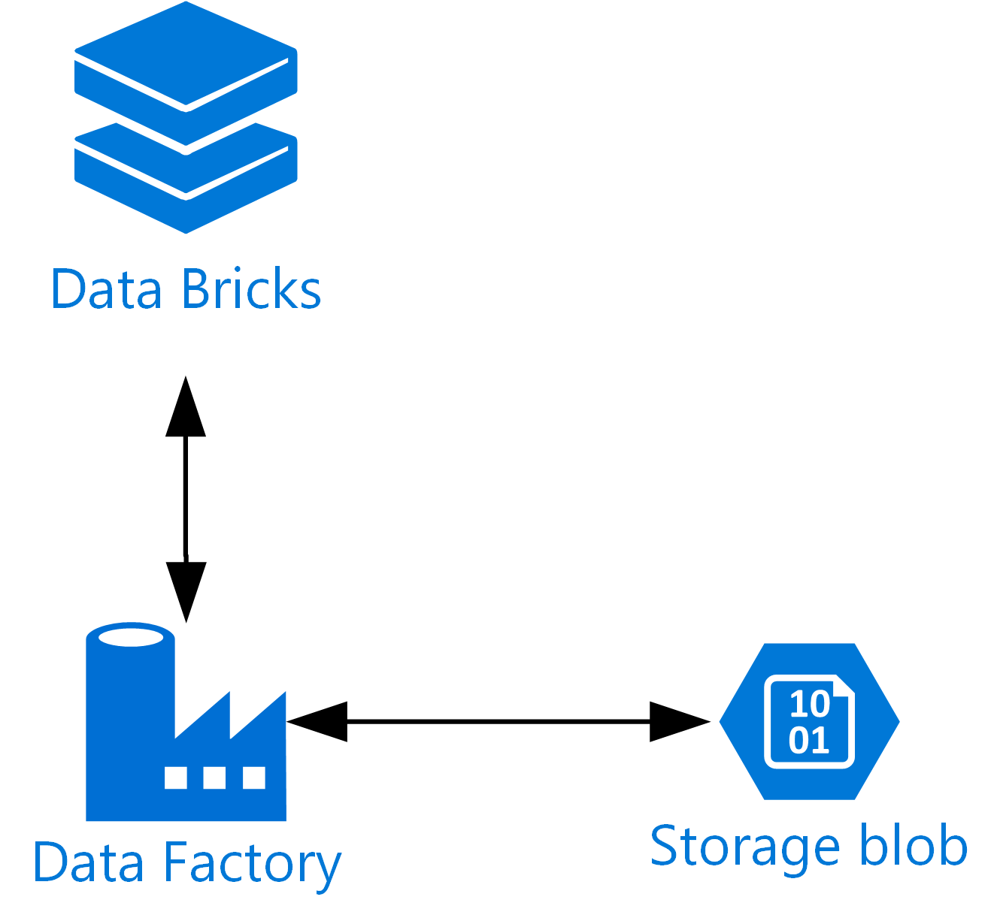

We'll consolidate the weather data to a single table, and we'll remap some of the other tables. Usually, this would all be done in a single pipeline. You can see below how this would be done by connecting the three data copy operations to the the next action with the green arrows (drag the green square on the right of an action to do this). Here, though, we'll create a separate prep pipeline which will allow us to manually trigger the job without re-running all of the tumbling window jobs as we did before.

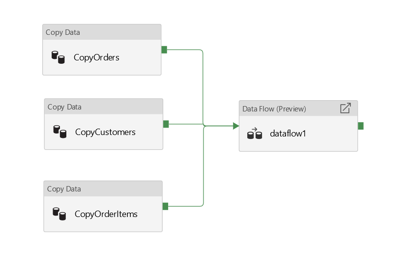

# Setup

## Weather Data

First up we'll look at weather data. Since you will only have a single day of weather data we'll start by uploading some more sample data. Download the [Azure Storage Explorer](https://azure.microsoft.com/en-gb/features/storage-explorer/) and install it. Then download the [Sample Weather Data](https://github.com/davedoesdemos/DataLakeInADay/raw/master/data/weatherdata/SampleWeatherData.zip) and unzip somewhere on your system. Then use the storage explorer to upload the files into your storage account under /raw/WeatherCSV alongside your other data.

Don't wait for this to complete, just let the upload happen in the background.

## Data Prep Pipeline

### Weather Data

In Data Factory, create a new pipeline and name it PipelineDataPrep. Add a Copy Data action to this and call that CopyWeatherData. On the source tab, click New to create a new dataset. Select Blob Storage and then your AzureBlobStorage linked service. Name this dataset DelimitedTextWeatherSource and then select /raw/weatherCSV as the folder and tick first row as header. Select no schema and click finish.

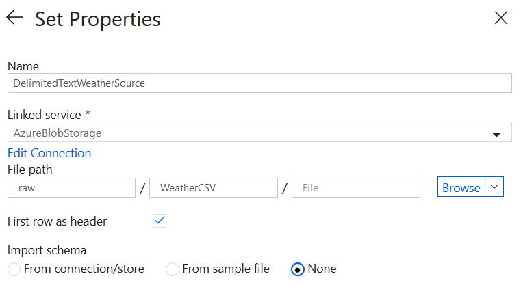

Repeat this process on the Sink tab but use the name DelimitedTextWeatherSink and change the path to /model/Weather

Back on the sink tab of the copy activity, change the copy behaviour to "merge files" and the extension to .csv

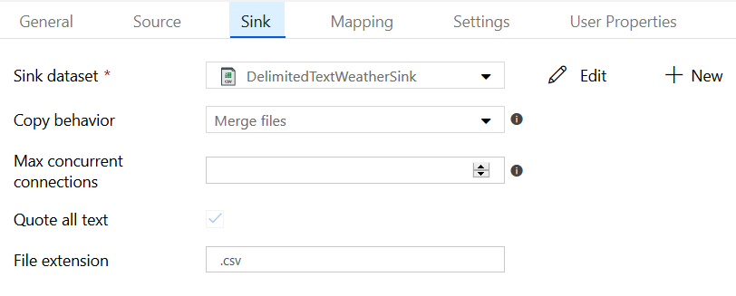

This job is now ready to run, and will create a single table in CSV format with all of the weather data consolidated.

### Sales Data

Now we'll use a mapping data flow to process the sales data into tables and aggregates. This flow chart shows where data will move. We'll keep the customer table in the final model. We'll also pull out individual cities to create a City dimension table and do the same thing with Items from the order items table. Finally we'll consolidate the order information into a single fact table with one row per order item. We are showing how to model data here so have used some simple examples - please do not assume this is realistic to a normal data set.

Once we have the fact table, we will then create some aggregation tables with the data to speed up reporting. 

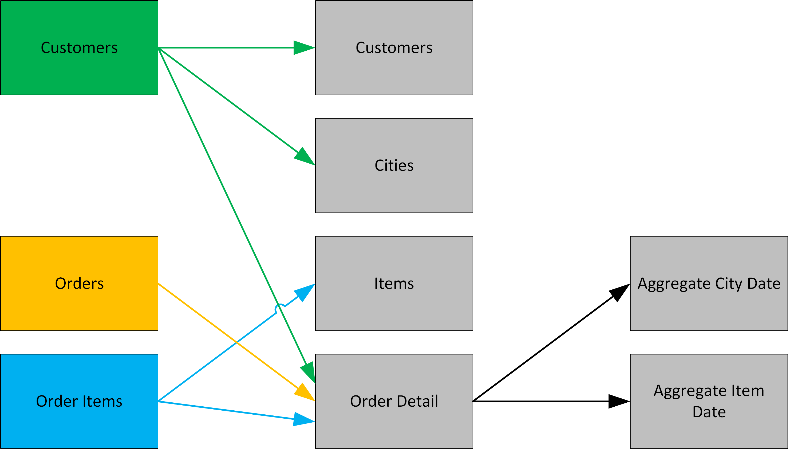

On your "pipelineDataPrep" canvas, drag in a data flow activity. Then select "Create new Data Flow" and then "Mapping Data Flow" and click Finish.

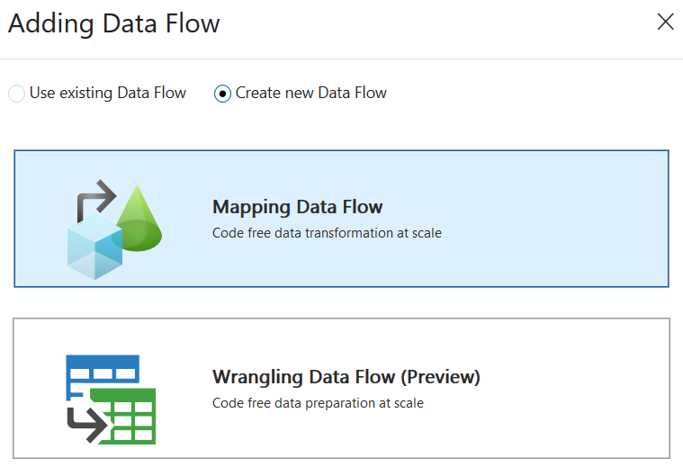

You'll then be placed into the Data Flows designer, ready to create your data flow. Name the Data Flow "dataFlowModeling" and then click "add Source" in the designer.

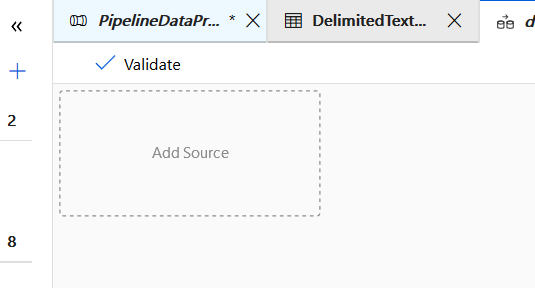

On your source settings, name the Output Stream "sourceCustomers". Select DelimitedTextCustomers as the source data set.

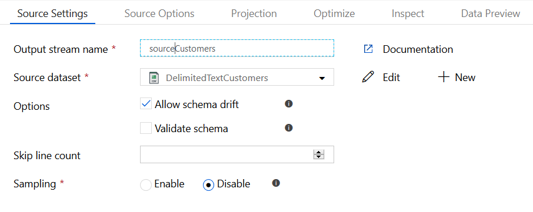

Since we didn't set up a schema on the CSV data sets in Lab 1 you'll need to do that now. Because we now have data in the files we can simply import the schema. Click on the edit button next to DelimitedTextCustomers to edit the data set. Go to the Schema tab and click "Import Schema" then "From Files with \*.\*" and you should see the schema imported. We can now use these columns in the data flow directly.

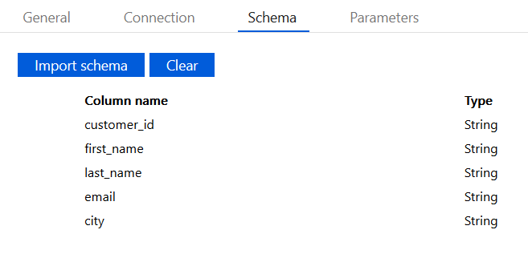

Go back to the data flow and click the plus sign next to sourceCustomers in the designer and choose an aggregate action. Name this UniqueCities. Under Group By select city.

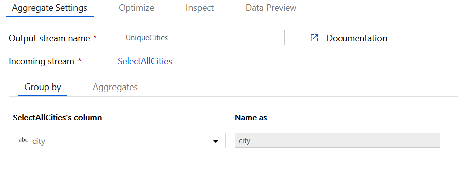

Click the Aggregates tab and type "CityCount" into the column name and then count(city) in the expression

This creates us a table with each city having one row, and the number of times that city appears in the other row. Add in a select activity called SelectUniqueCities after the aggregate and select only the city column.

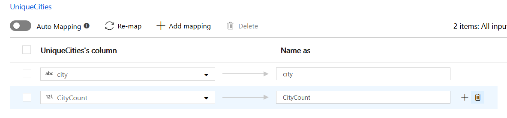

 This will remove the count column since we don't need it. Now, add a sink activity and name it "sinkCities" Click the new button to create a dataset on Blob Storage as a CSV called modelCities. Use the file path /model/cities. Tick first row as header and no schema.

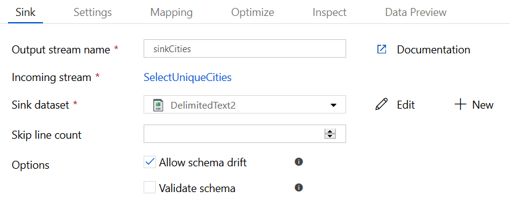

Now click the settings tab and choose "Clear the folder", "Output to single file", and enter "cities.csv" as the name. This will ensure that each time the job runs we have a single file with all of the city data.

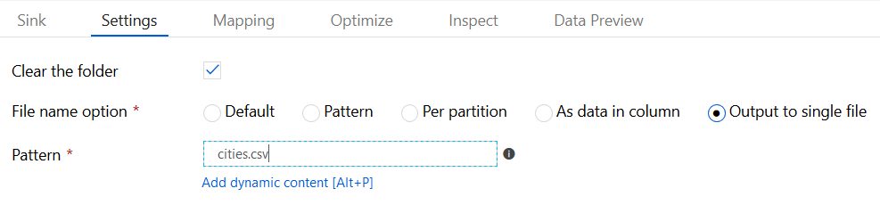

Now, click the plus next to customers and add a sink activity called sinkCustomers. As above, add a dataset in /model/customers and name the output file customers.csv. This job will simply copy the whole customer table as-is into our model directory for consumption.

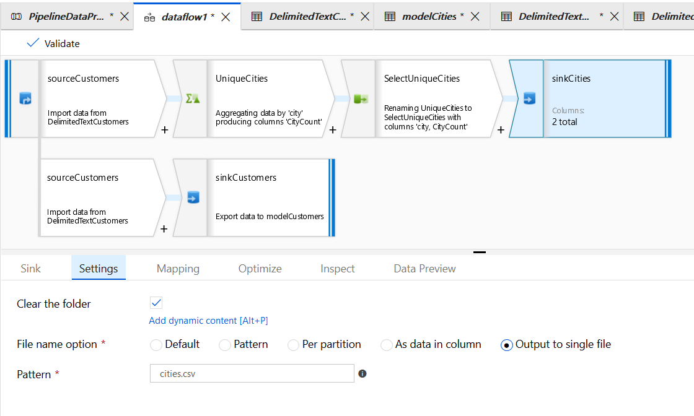

Now add in another source and this time select DelimitedTextOrderItems. Add in the aggregate and select as before but this time using the item column to create a sink with items.csv and just a list of unique items. This process will be identical to the cities pipeline above but for items.

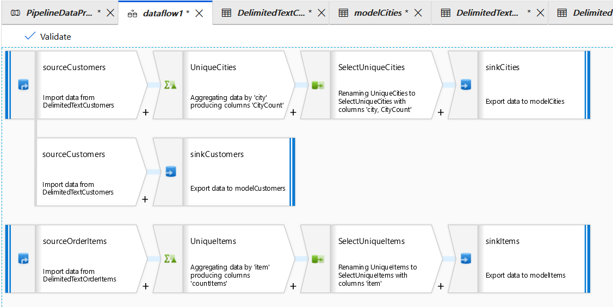

Now, add in a third source for orders. Create a new data set called DelimitedTextAllOrders and connect to /raw/orders. We need to do this for the demo since this pipeline won't use the parameters we configured in the previous lab so we just want all files. Usually you'd re-use that data set. If you look at the existing data set you'll see the file path is as below. We need the file name box empty for this demo.

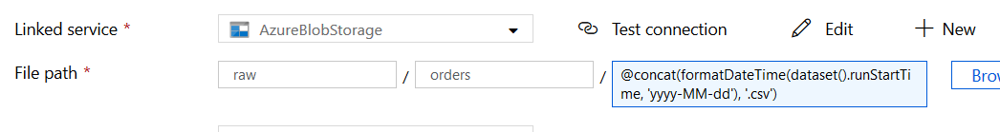

After sourceOrders add in a join action. Name this joinOrderData then select sourceOrderItems as the right stream. Select Left outer as the join type and then order_id for both columns.

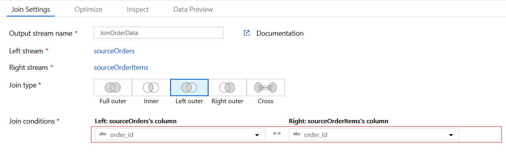

Now create a second join after the first called JoinOrderCustomers. This time add in sourceCustomers as the right stream. Choose left outer and customer_id.

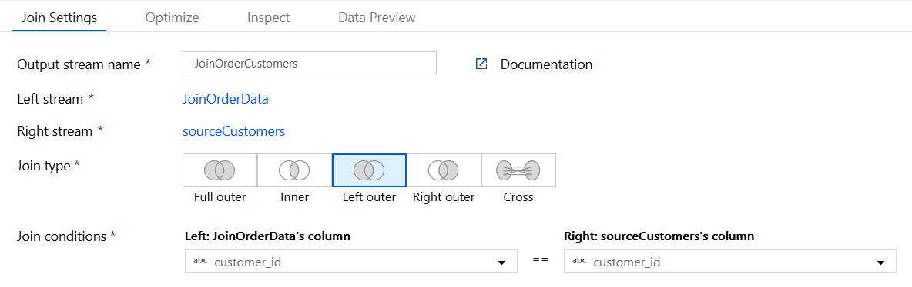

Now we need to format the date column. Create a derived column task and name it "formatDate". Select date as the column and then in the expression write toDate(date, 'yyyy-MM-dd')

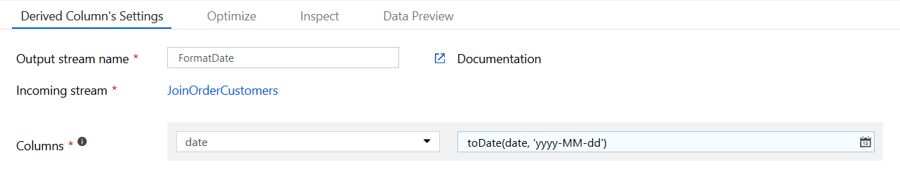

Now create a select task after your derived column. Call this SelectRemoveColumns. We'll use this task to select the final columns present in the table. Remove all columns except those shown below. Note that the left side shows the source of the column as well as a column name. We want to keep the IDs from the Orders table where we can. Remove all customer information except city

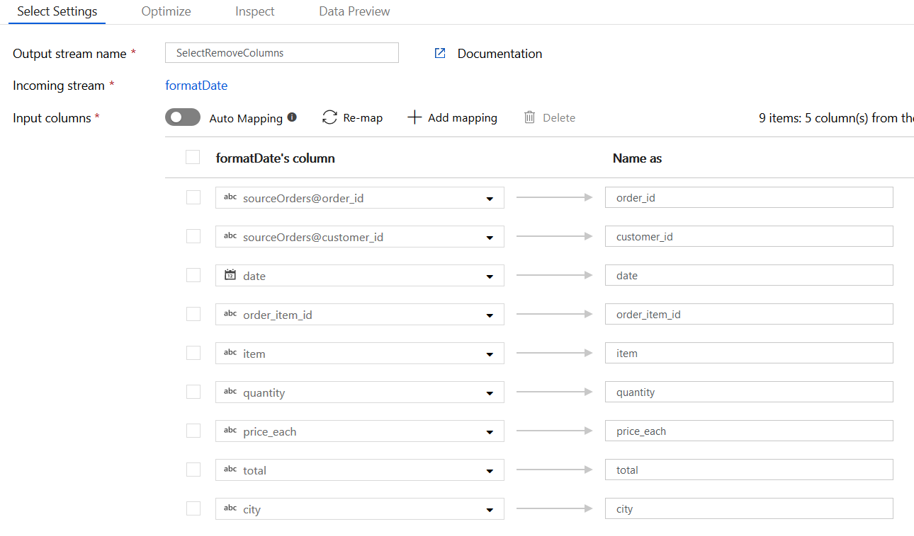

Now that we have the final data set, create a sink called sinkOrdersFactCSV with a data set called modelOrdersFactCSV. Store this in /model/ordersfact and use the filename ordersfact.csv in the sink task.

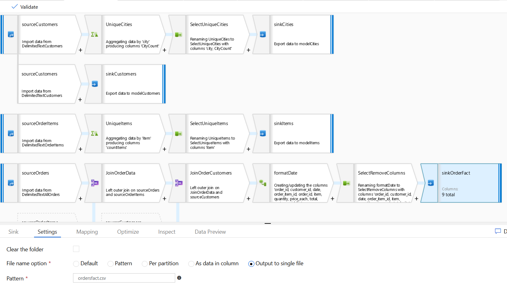

Finally, we need to create two aggregate tables. Click the plus sign next to SelectRemoveColumns and create two new branches, each with an aggregate task as we'll be aggregating this table. Name one AggregateCityDate and the other AggregateItemDate

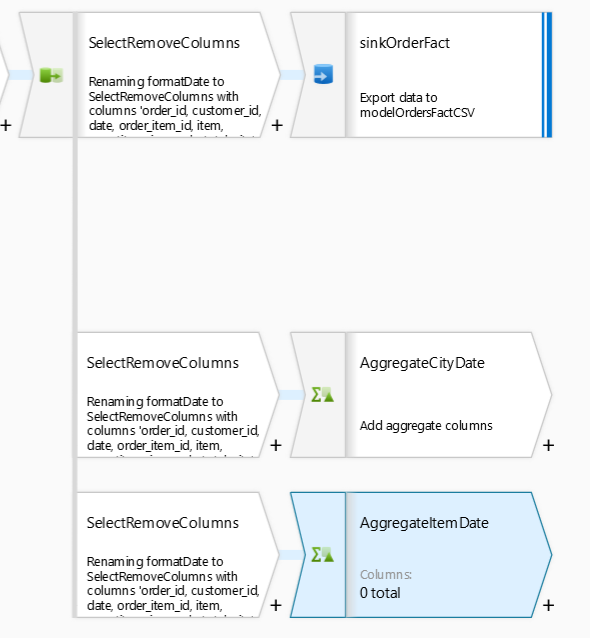

Under Group by on aggregateCityDate, select city and date as columns

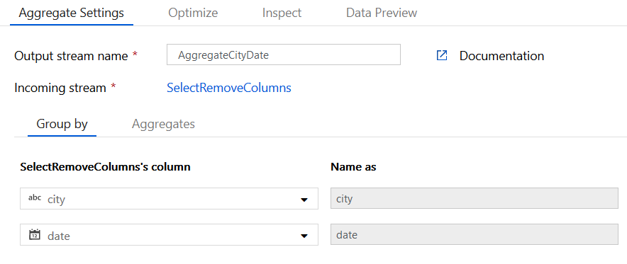

under aggregates, set up cityCount as count(city), itemCount as count(item) and totalSum as sum(toFloat(total))

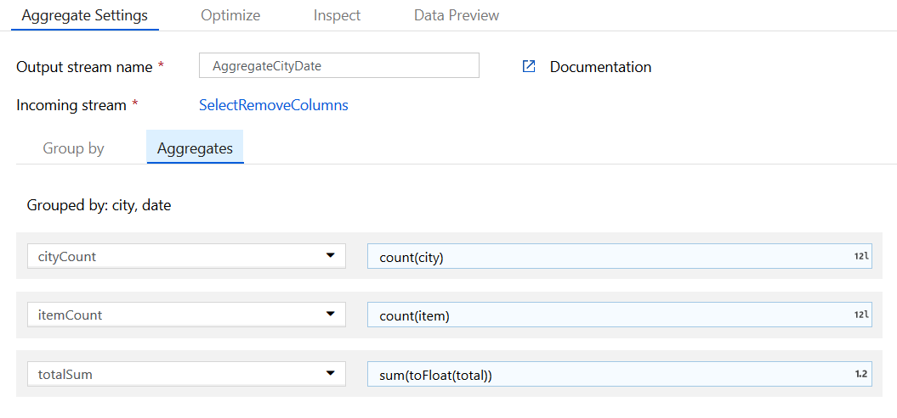

on aggregateItemDate, set up item and date as the group by columns

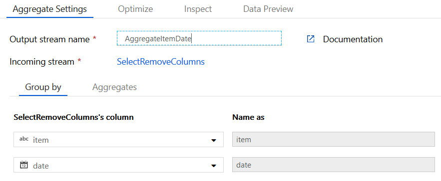

set up countItems as count(item), maxQuantity as max(quantity) and minQuantity as min(quantity)

Create two more sinks for these tables in the model under /model/AggrItemDate and /model/AggrCityDate. Your entire data flow should now look like this:

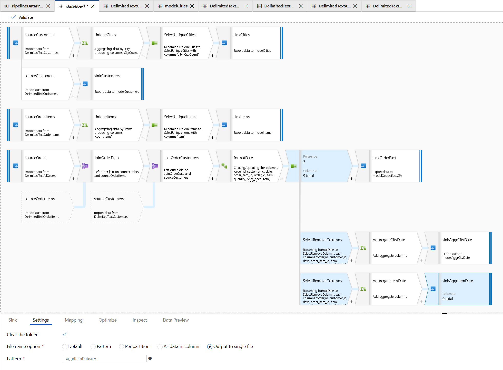

### Trigger

Now pubish all to save your work. Click on your data prep pipeline and then add trigger, trigger now then finish. You can use the monitor tab in Data Factory to see when this job completes, and then Azure Storage Explorer to view the resulting CSV files.

# Next

Now you can go on to [Lab 4](../Lab4/Lab4.md)