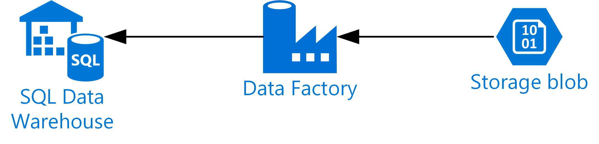
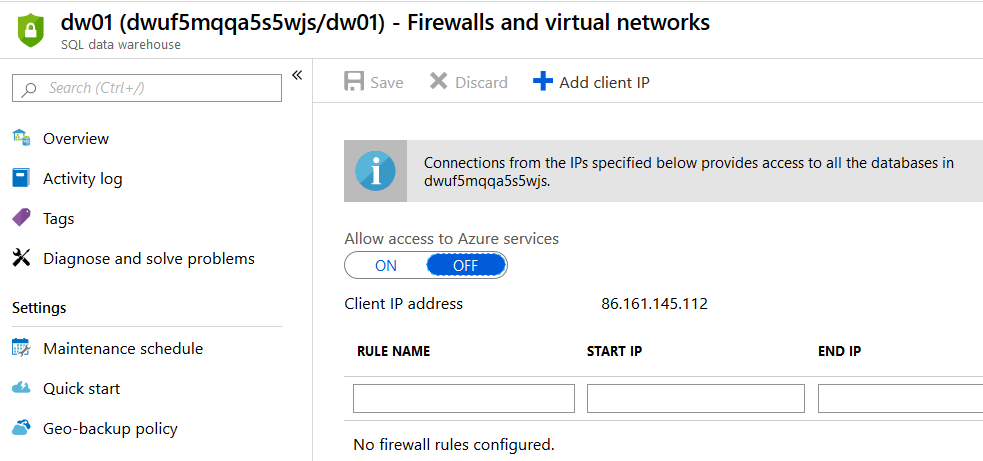
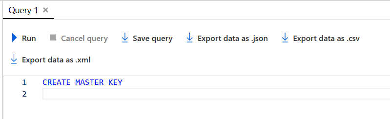
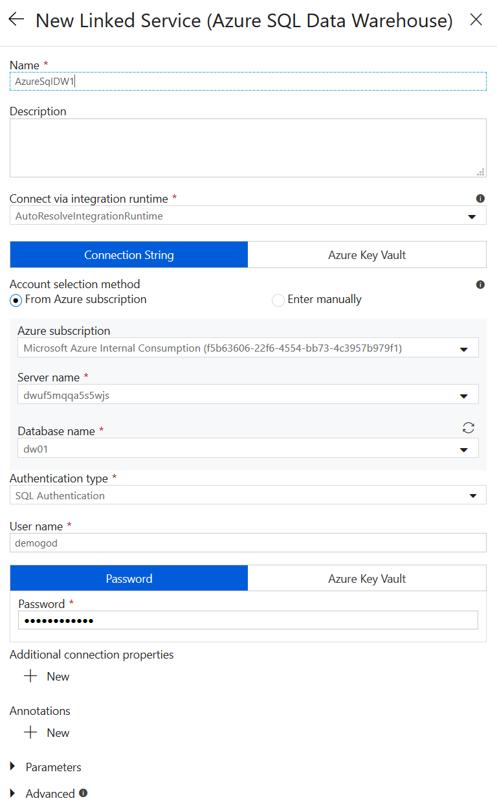
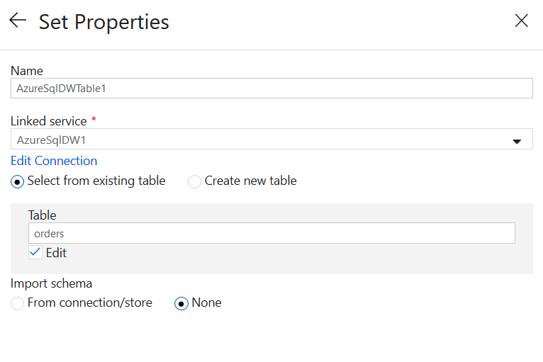
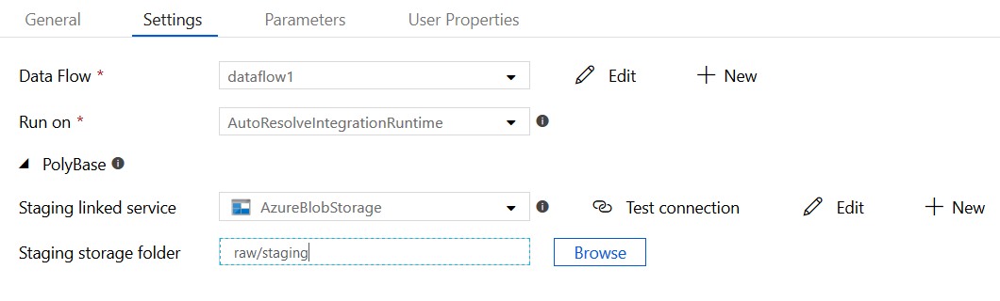
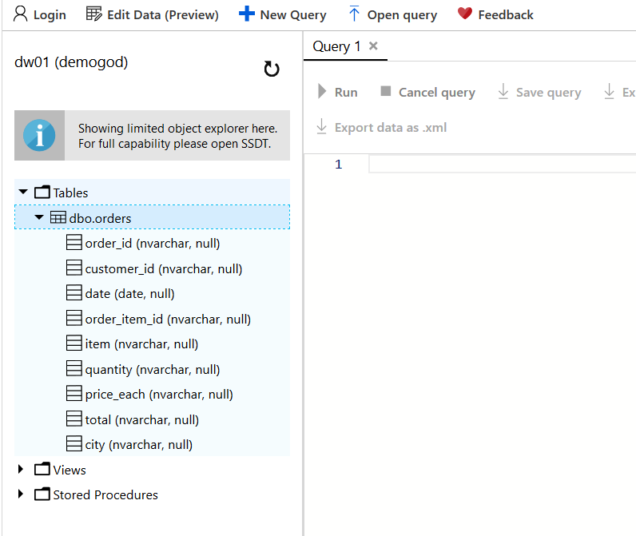

# Lab 4 - Load data into SQL DW

## Introduction

In this lab, we will copy some data into an Azure SQL Data Warehouse database to be used from Power BI. Using a SQL Data Warehouse will make the data more flexible since queries can be run in the database engine. It also scales very well for larger data sets, and allows more fine grained control of the data. In this lab we'll just load some data to show it as part of a data lake process. SQL Data Warehouse in detail is out of the scope of these labs.



# Setup

## SQL Data Warehouse

First, we need to create a master key within the SQL Data Warehouse database. This will be used for security when working from Azure Data Factory.

In the Azure portal, browse to your SQL Data Warehouse (DW01). Click on "Firewalls and Virtual Networks" in the menu. Click on to allow access to Azure Services then click "Add Client IP" then click Save. This will add your current IP to the firewall to allow access to the database from the web client. It's possible you may need to do this more than once depending on your Internet connection (within Microsoft this can fail as we have multiple routes out to the Internet with different IPs)



Once the rule has been applied, click on "Query editor" in the side menu and log in with **demogod" and your password.

Enter the following query and then press run.

```SQL
CREATE MASTER KEY
```




Once the query returns successfully SQL Data Warehouse is configured.

## Data Factory

In Data Factory we will now extend the data flow previously created to include the data load into SQL Data Warehouse. Open Data Factory and then click your data flow. Click the plus after SelectRemoveColumns and choose to add a branch. On the new branch, add a sink task. Name the sink task sinkOrderFactDW and create a new data set. This time, select Azure SQL Data Warehouse as the data store.


Name the data set modelOrdersFactDW and select new linked service. On the linked service, select your SQL server (dw-*uniquestring*) and database (DW01). Use **demogod** and your password with SQL authentication to log in. Click "test connection" to ensure this is working and then click Finish



On the properties screen, tick the edit box and type "orders" under table. This will create a new table called orders to put our data in. Click none for schema and click finish.



Now click your pipelineDataPrep in the menu and click the data flow action. On the settings tab, select AzureBlobStorage as your staging linked service and type raw/staging for the staging storage folder. This will use your Blob store as a staging area for data to be loaded into SQL Data Warehouse. Behind the scened, Polybase will load your data from disk after it has been output from data flows.



Click Publish all to save your work and then click add trigger, Trigger Now, Finish to complete. You can monitor the job in Data Factory on the monitor tab. Once complete you can use the SAL Data Warehouse query editor to see the table in SQL DW.



# Next

Now you can go on to [Lab 5](../Lab5/Lab5.md)