# Lab 5 - Load into Power BI

## Introduction

In this final lab, we will bring our data into Power BI and create a dashboard to visualise and dig in to the information.

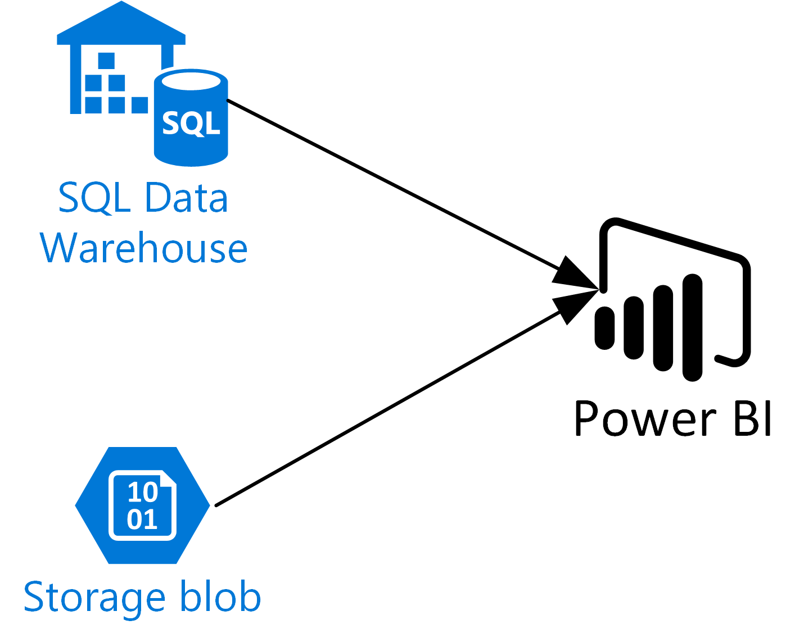

# Setup

## Data Lake

Download the weather data from [here](https://github.com/davedoesdemos/DataLakeInADay/raw/master/data/weatherdata/weather.csv) and copy this file into your data lake to replace the .csv file under /model/weather. This file has weather for all cities in the demo whereas we only processed weather for 4 cities in the previous labs. For several years of data in hundreds of cities it would have been unmanageable in a demo to create sample data or even process it. This is the purpose of big data processing, however, and so these large numbers of files are not an issue in a production environment since we process them in parallel accross large clusters.

## Power BI

### Blob Storage

<table>
<tr>
<td width="60%">Open Power BI Desktop and create a new empty file. Click "Get Data" on the menu and select Azure Blob Storage from the list then press connect</td>
<td width="40%">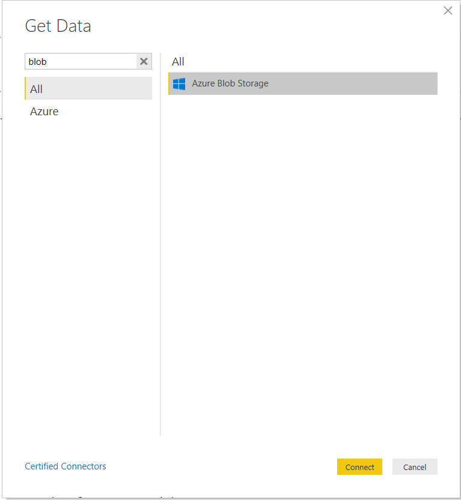</td>
</tr>
<tr>
<td width="60%">In the Azure Portal, browse to your storage account and then click properties on the menu. Copy the "Primary Blob Service Endpoint" field</td>
<td width="40%">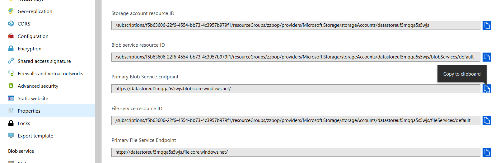</td>
</tr>
<tr>
<td width="60%">Paste this url into the Power BI dialog box then click ok</td>
<td width="40%">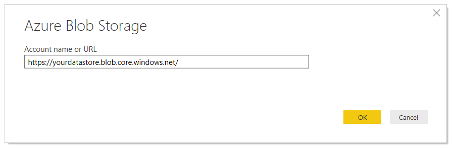</td>
</tr>
<tr>
<td width="60%">In the Azure Portal click on Access Keys and copy one of your storage account access keys</td>
<td width="40%">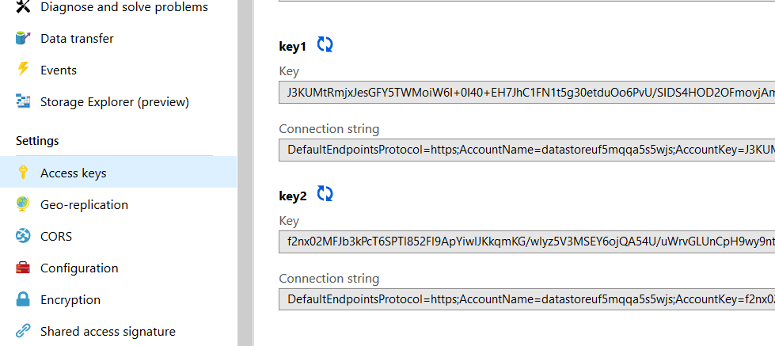</td>
</tr>
<tr>
<td width="60%">Paste this in to Power BI and click next

Use the navigator to select the model container and click Load</td>
<td width="40%">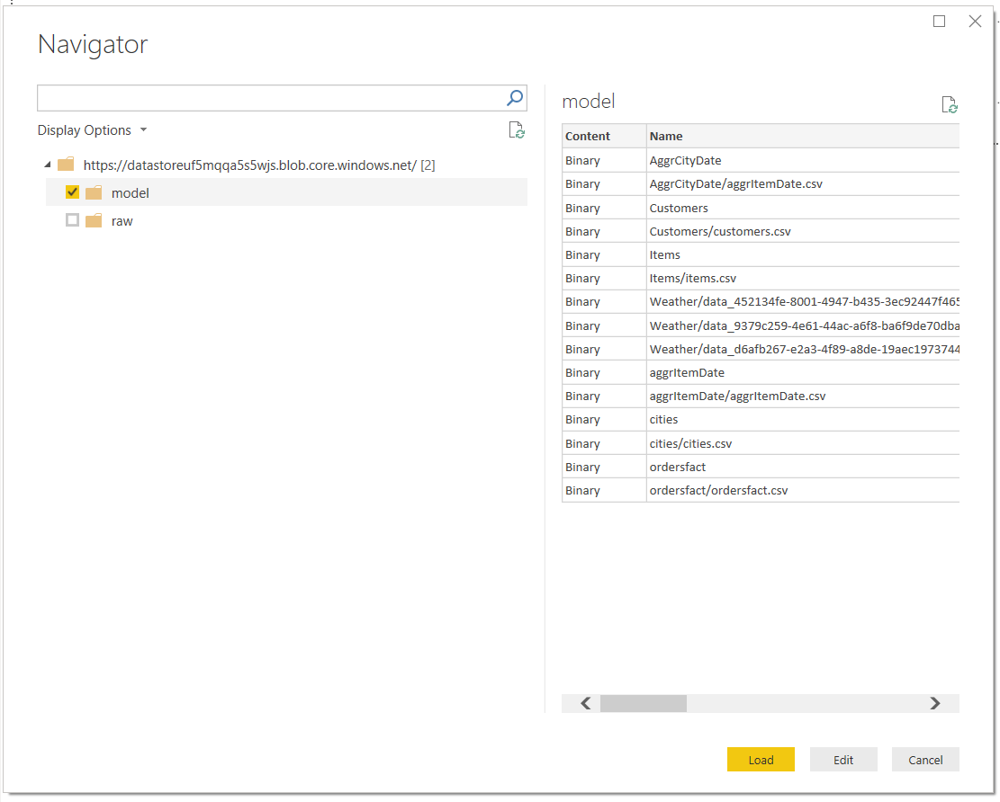</td>
</tr>
<tr>
<td width="60%">In Power BI click the model button on the left and then transform data on the menu</td>
<td width="40%">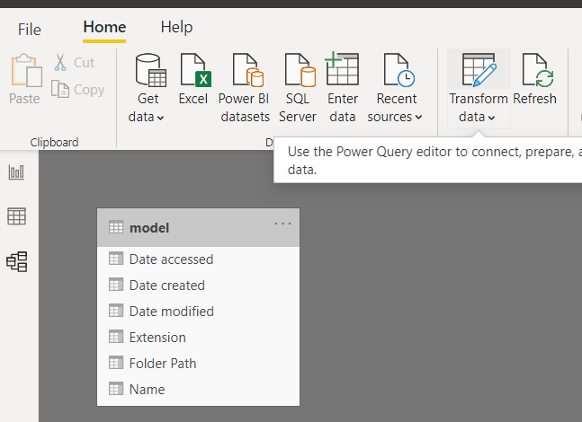</td>
</tr>
<tr>
<td width="60%">In the query editor, right click "model" and copy. Right click model again and click Paste. Do this to create a total of 6 copies of the model. We will expand each one into a single table with the exception of the orders fact table, which we'll get from SQL Data Warehouse.</td>
<td width="40%">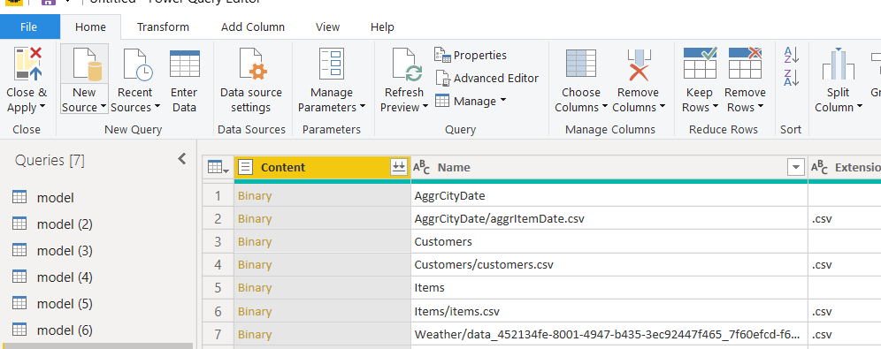</td>
</tr>
<tr>
<td width="60%">Now for each of the copies of the model, click the yellow "Binary" text on one of the lines containing .csv in the extension column. This will expand out a single file in your data model. Rename the model to the same as the file so that you can identify what data is where.</td>
<td width="40%">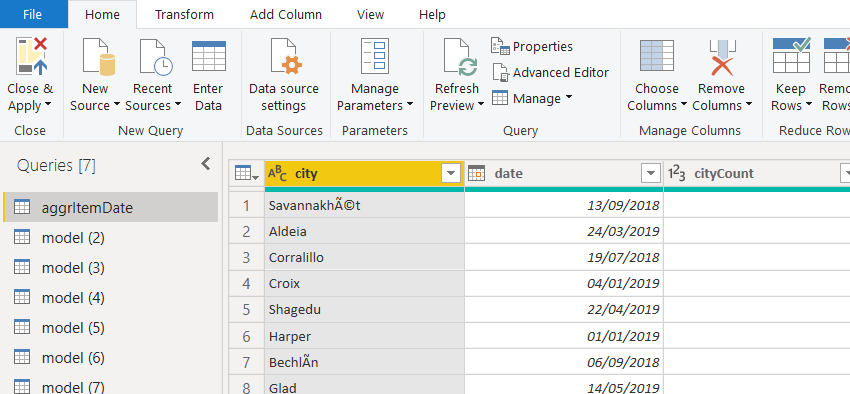</td>
</tr>
<tr>
<td width="60%">You should end up with a list as below</td>
<td width="40%">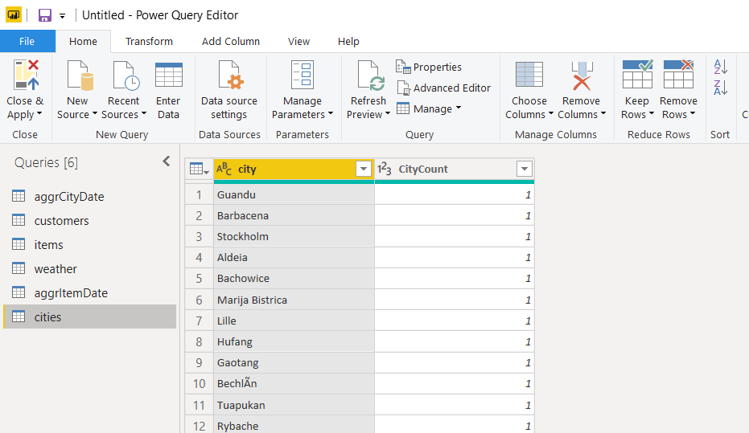</td>
</tr>
</table>

### SQL DW

<table>
<tr>
<td width="60%">Next, click New source and select Azure SQL Data Warehouse.</td>
<td width="40%">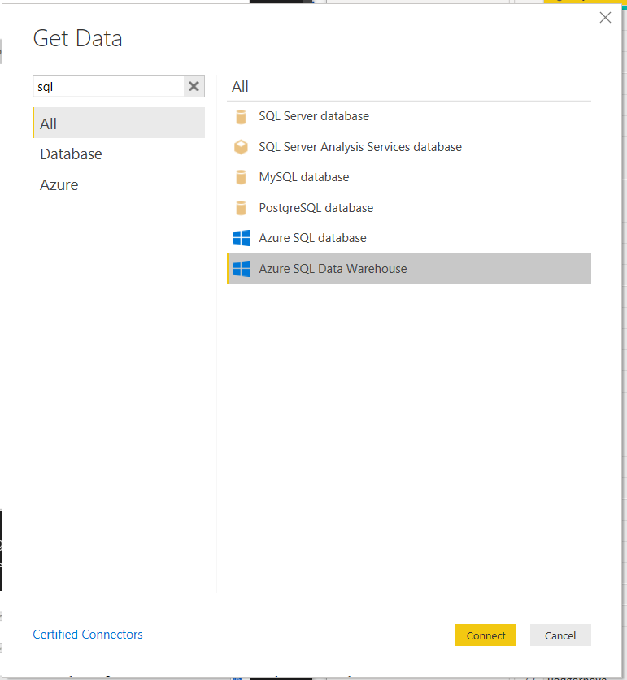</td>
</tr>
<tr>
<td width="60%">In the Azure portal, browse to your SQL data warehouse (DW01) and copy the Server Name from the overview page. Paste this into the Power BI dialog, and enter DW01 as the database. Select Direct Query and click OK.</td>
<td width="40%">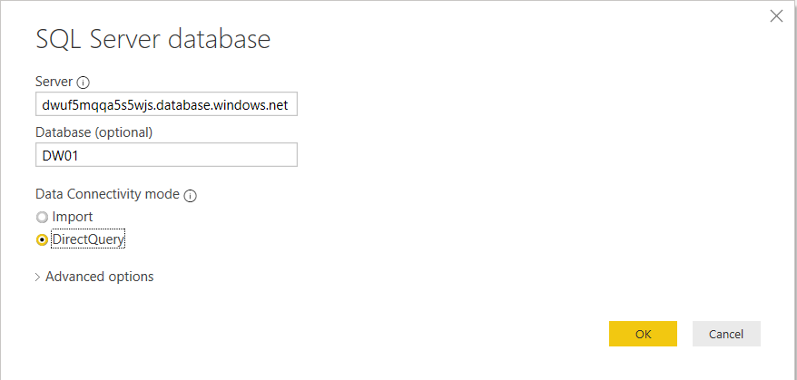</td>
</tr>
<tr>
<td width="60%">Enter the credentials for **demogod** and click connect</td>
<td width="40%">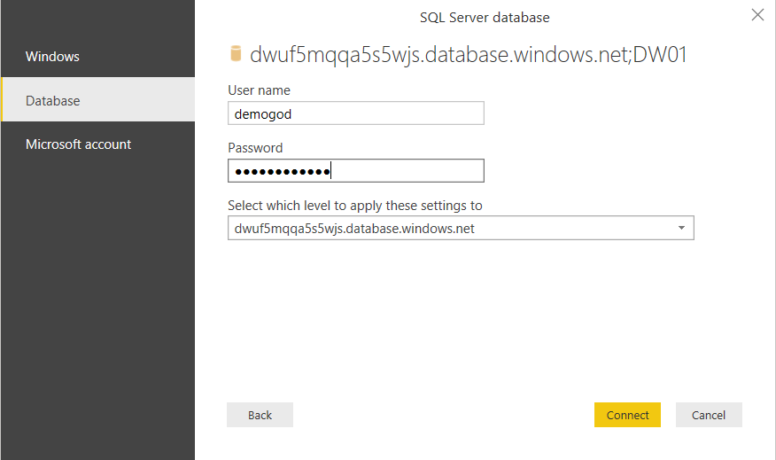</td>
</tr>
<tr>
<td width="60%">Select the orders table and click OK</td>
<td width="40%">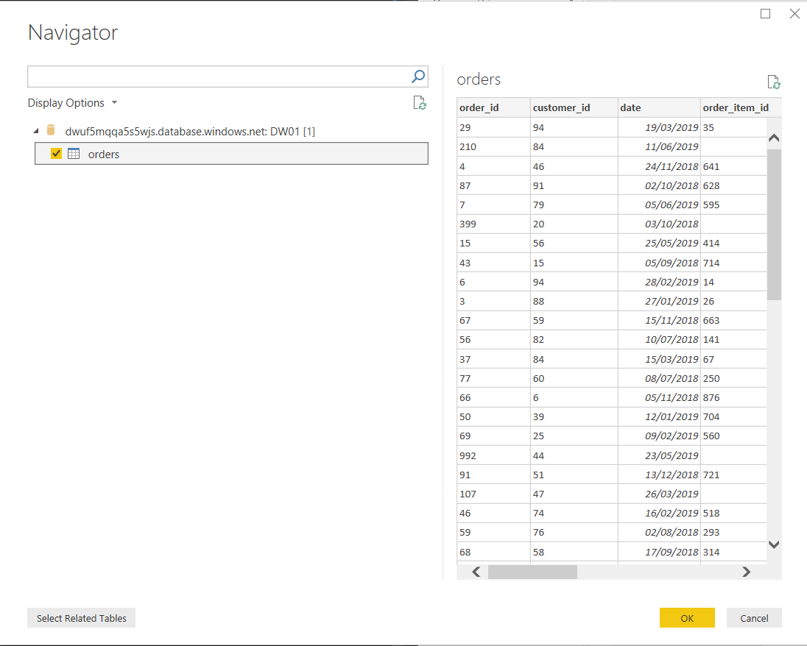</td>
</tr>
<tr>
<td width="60%">Click close and apply on the menu</td>
<td width="40%">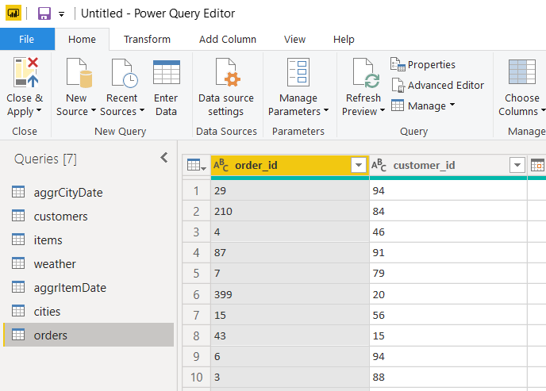</td>
</tr>
</table>

### Modeling

<table>
<tr>
<td width="60%">Click on the orders table and then the total column. Set the data type to Decimal Number and currency. </td>
<td width="40%">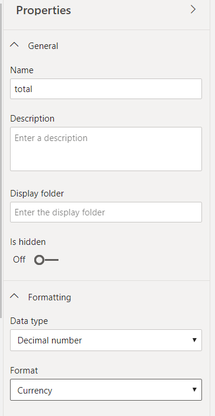</td>
</tr>
<tr>
<td width="60%">Repeat this to set quantity to whole number, and price each to decimal number and currency.
Next, click on aggrCityDate and then click "is hidden" in the properties pane</td>
<td width="40%">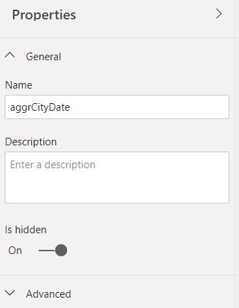</td>
</tr>
</table>

Repeat this step for the aggrItemDate table.

Next, create the following relationships:

| Table 1 | Column 1 | Cardinality 1 | Cardinality 2 | Column 2 | Table 2 |
|---------|----------|---------------|---------------|----------|---------|
| Weather | City | Many | Many | City | Orders |
| Items | Item | One | Many | item | Orders |
| Customers | customer_id | One | Many | customer_id | Orders |
| Customers | city | Many | One | City | Cities |
| Cities | city | One | Many | city | aggrCityDate |
| AggrItemDate | item | Many | One | item | Items |

<table>
<tr>
<td width="60%">To do this, click on the Manage Relationships button on the menu</td>
<td width="40%">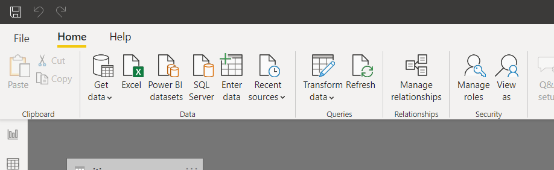</td>
</tr>
<tr>
<td width="60%">Then click New...</td>
<td width="40%">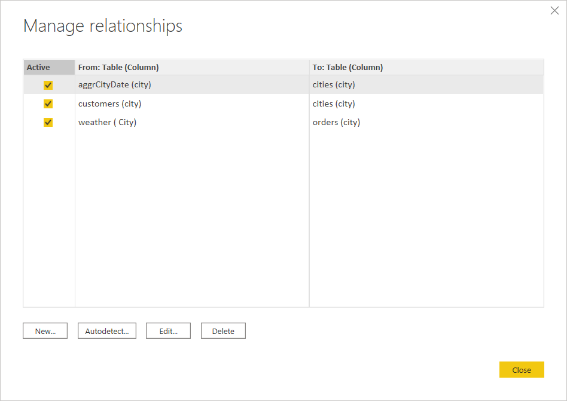</td>
</tr>
<tr>
<td width="60%">Fill in the tables and cardinality, ensuring you select the correct columns.</td>
<td width="40%"></td>
</tr>
<tr>
<td width="60%">You can also drag and drop columns in the main designer interface if you are more comfortable with that method. Repeat for all relationships as in the table above</td>
<td width="40%">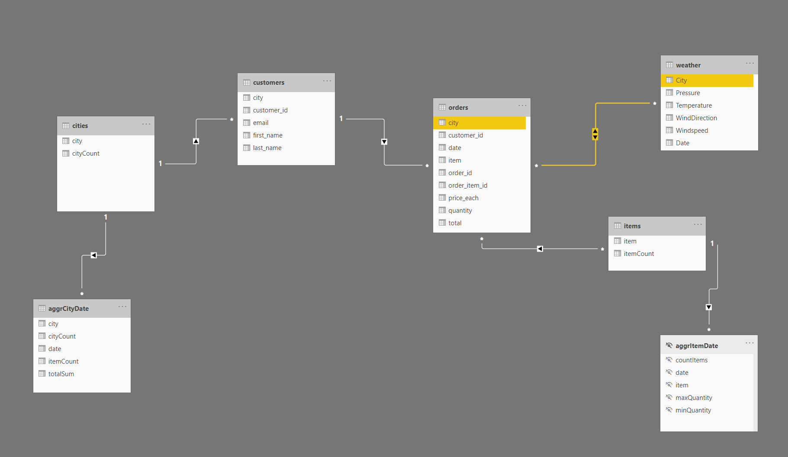</td>
</tr>
<tr>
<td width="60%">Next, click on the aggrCityDate ellipsis menu and select Manage Aggregations. Set the aggregations as below:</td>
<td width="40%">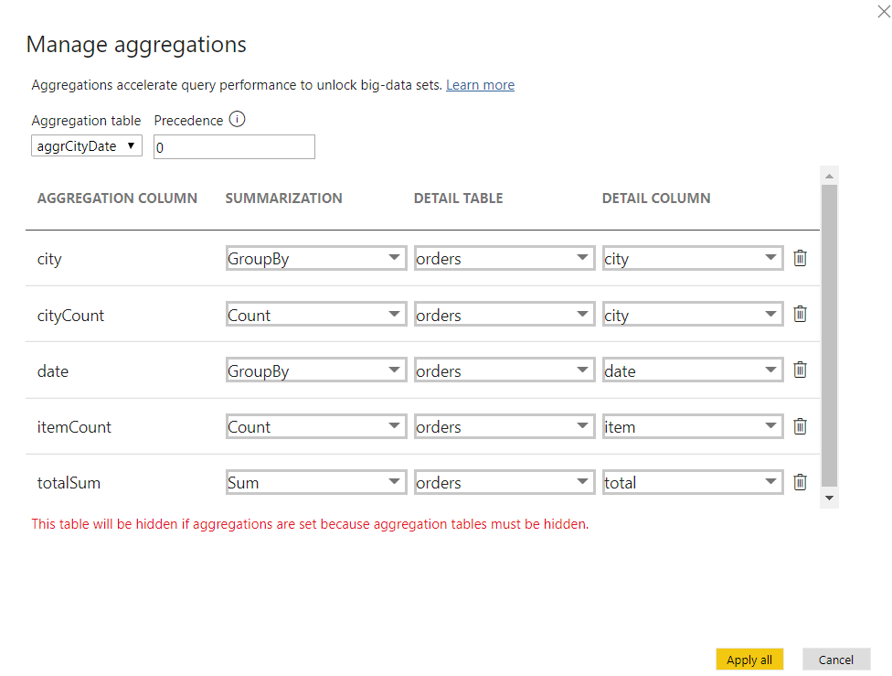</td>
</tr>
<tr>
<td width="60%">Click on aggrItemDate and set the aggregations as below:</td>
<td width="40%">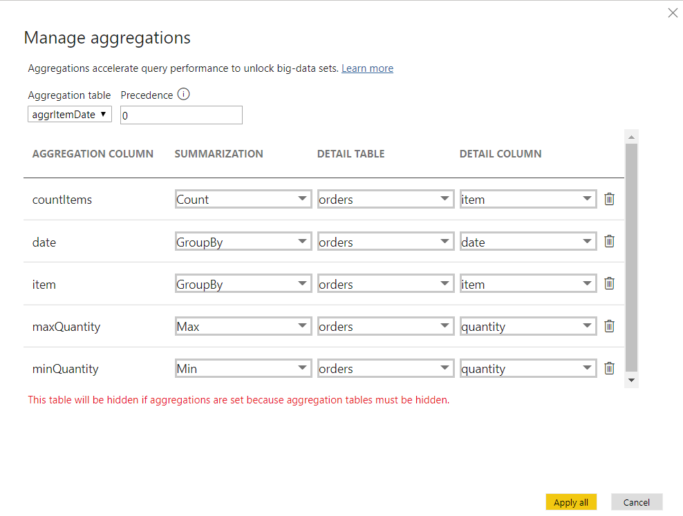</td>
</tr>
</table>

### Report

<table>
<tr>
<td width="60%">Go to the report tab in Power BI and add a matrix visualisation. From the orders table, drag City, date and order_id to the Rows box and then Item to the Values box, then set the values to count of item</td>
<td width="40%">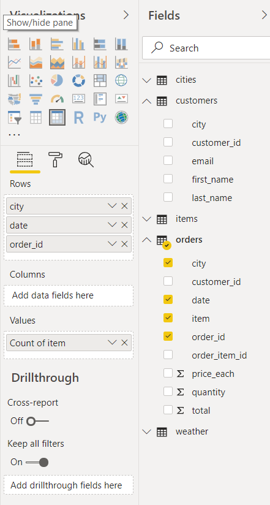</td>
</tr>
<tr>
<td width="60%">On the report, right click a city and select Drill Down</td>
<td width="40%">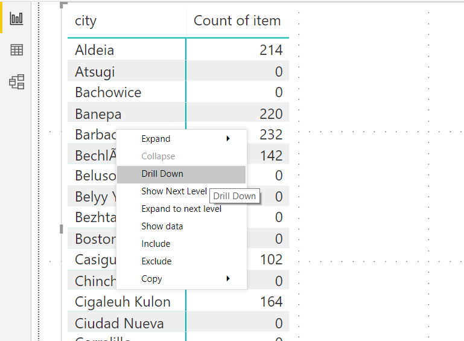</td>
</tr>
<tr>
<td width="60%">You'll then see the next level of detail. If you look in the query log of SQL Data Warehouse, you won't see any query at this point since all data has come from our aggregations.

If you now drill down to a row which shows a large number of items, Power BI is forced to expand out with a query to the fact table and so will send a query to SQL Data Warehouse. </td>
<td width="40%"></td>
</tr>
<tr>
<td width="60%">You may need to sort queries by start time in the monitoring pane</td>
<td width="40%">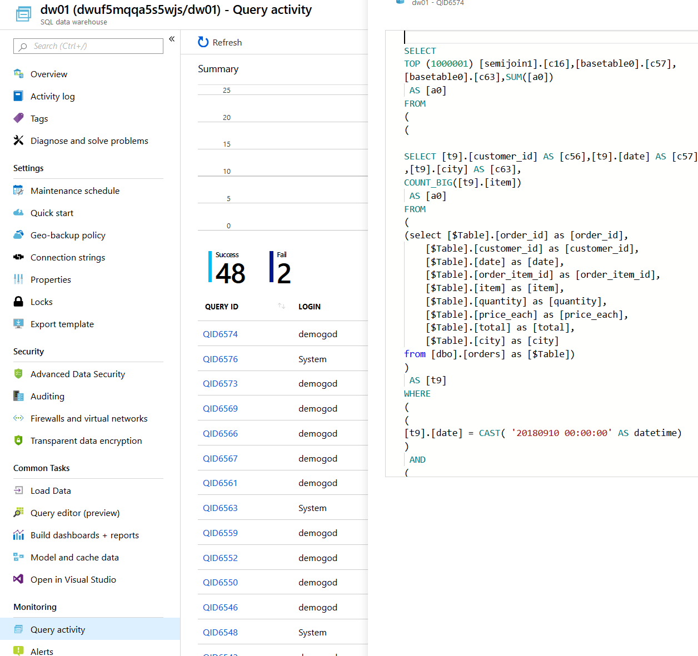</td>
</tr>
<tr>
<td width="60%">Now, add in temperature from the weather table and set to "average of temperature" in the Values box for the matrix.</td>
<td width="40%">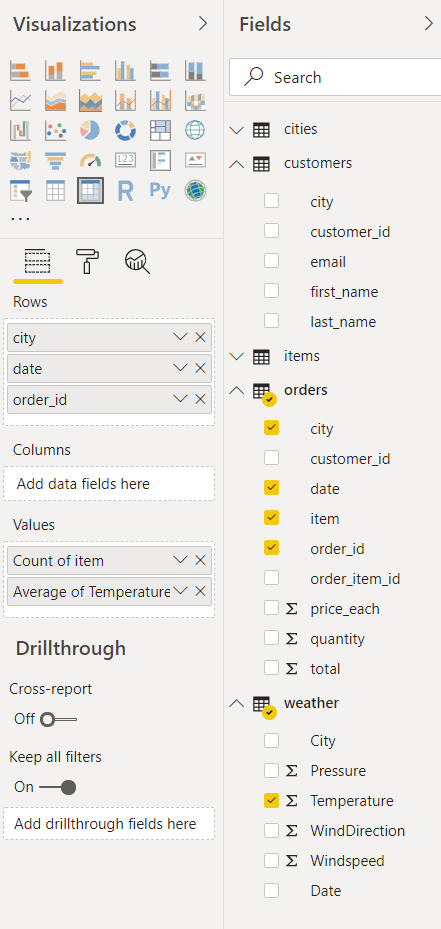</td>
</tr>
</table>

You'll now be able to see the weather information we collected from the Internet as you drill down for the city. This demonstrates how simple it is to bring in external data sources and merge with your own information, regardless of scale or size.