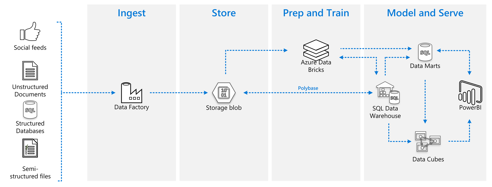

# Data Lake in a Day

## Introduction
This repository contains workshops and content for the data lake in a day engagement. While this is designed around the classroom and MTC, there is no reason you shouldn't work through the demos yourself at any time to gain an understanding of the platform.

**Who it's for**

This workshop is aimed at data specialists with no experience of the cloud data platform and data lake technology, as well as strategists, architects and execs who would like some experience of the ease of development of cloud data platforms. The outcome for those with data experience will be a quick start to boost confidence in starting to use these components, while the outcome for others will be aiding the decision making process through seeing products and techniques in action.

This workshop is not an in depth technical day, nor is it designed to teach you products in depth. Instead the aim is an introduction to the entire concept of data lakes, and it does this through building a lake. The day does not contain presentations designed to explain what a lake is or does, it is a practical hands on day and an understanding of concepts will develop through the labs.

The below image shows an overview of the platform components we will be using during the day.

**Concepts Covered**

* Data Factory
  * Integration Runtime
  * Data Ingest
  * Data Transformation
  * Tumbling Window
  * Using parameters to control ingest
* Mapping Data Flows
  * Model Data
  * Create Aggregations
* Logic Apps
  * Call an external API
* Data Lake
  * Organise a data lake
  * Segregate data by purpose
* Power BI
  * Use Aggregations
  * Use drill through for multi-layered modeling
  * Consume data from different sources

# Proctor and Event Planning

Resources to support running this workshop smoothly. These include suggested timetables for the day, as well as some notes about the labs and other content. Feedback from sessions will be added here as appropriate to support future workshops.

* [Proctor Notes](ProctorNotes/ProctorNotes.md)

# Sessions

These sessions are informational presentations which can be used during the day to give context to the labs and explain more about data lakes and where they fit in the broader IT ecosystem.

* [Session 1 - Data Platform Overview and Options](Session1/Session1.md) [video](https://youtu.be/vVvb1muzQZA)
* [Session 2 - Organising a Data Lake](Session2/Session2.md) [video](https://youtu.be/gRaj7gYSi3A)
* [Session 3 - The Wider Ecosystem](Session3/Session3.md)

# Infrastructure

Details about the infrastructure we deploy for the labs, as well as instructions on how to deploy it. This includes automated deployment and username information.

* [Set up your infrastructure](infrastructure/readme.md) [video](https://youtu.be/BptCJJeSNaA)

Please deploy to the East US region, and use "Password123$" as your password.

# Labs

The labs build to a data lake reporting solution with multiple data sources. Here we will show how data can be collected from the Internet and merged with data from an internal Sales database. We will then process this information and create reports based on the data.

* [Lab 1 - Getting Internal data with Azure Data Factory and the integration Runtime](Lab1/Lab1.md) [video](https://youtu.be/tDvNjbbbASY)
* [Lab 2 - Getting external data using Logic App](Lab2/Lab2.md) [video](https://youtu.be/mw6KK5tun0Y)
* [Lab 3 - Processing Data using Mapping Data Flows](Lab3b/Lab3b.md)
* [Lab 4 - Load data into SQL DW](Lab4/Lab4.md)
* [Lab 5 - Load into Power BI](Lab5/Lab5.md)
